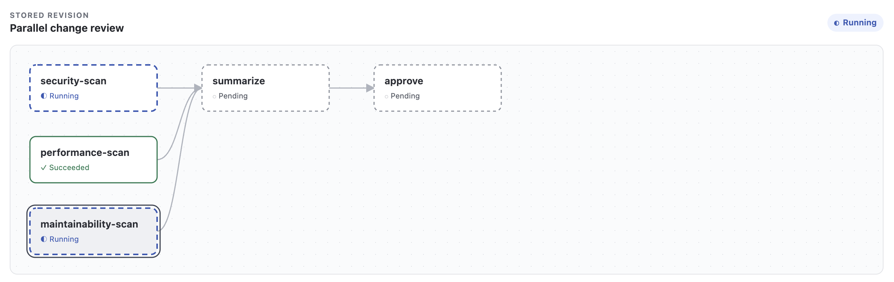

# Kilin

Deterministic, inspectable workflows for coding agents.

[](https://www.npmjs.com/package/@kilin-space/cli)
[](LICENSE)
[](https://docs.kilin.space/en)

Kilin is a local, CLI-first workflow runtime. You describe a finite workflow in two ordinary files,
validate it before anything runs, and execute it through the coding agents you already have
installed — Codex, Claude Code, or OpenCode.

It is built to be driven either by a person or by another agent: workflow and run commands expose
documented `--json` forms, while skill linking and Viewer launch remain terminal-facing setup and
inspection surfaces.

Kilin keeps orchestration explicit:

- workflows are plain files in your project or home directory;
- execution stays attached to the foreground CLI, with no daemon or background service;
- approvals are explicit barriers that hold the run until someone decides;
- writable work never overlaps another node;
- Kilin persists its results, captured logs, decisions, and lineage locally so they remain
  inspectable;
- content sent to provider CLIs may leave the host and follows each provider's network and
  retention policies; and
- the optional Viewer binds only to the local loopback interface.

## Driven by a person or by an agent

Workflow authoring, execution, monitoring, and approval are available as commands with `--json`
forms, so the thing driving Kilin can equally be you at a terminal or an outer agent runtime
supervising work it delegated. Non-interactive setup uses an explicit provider selection such as
`kilin skills link --providers agents`. The Viewer remains a human inspection surface, while an
outer agent can launch and supervise its attached CLI process through `--json`.

```text
┌─────────────────────────────────────────────────────────────────┐
│  OUTER AGENT RUNTIME                                            │
│  a person at a terminal  ·  or Codex / Claude Code / a script   │
└─────────────────────────────────────────────────────────────────┘
        │                                             ▲
        │  create   kilin workflow init               │  monitor   runs list · runs show
        │  update   edit WORKFLOW.yaml                │  track     runs wait --json
        │  start    kilin run · kilin trigger         │  inspect   kilin ui
        │  decide   runs approve · runs reject        │
        ▼                                             │
┌─────────────────────────────────────────────────────────────────┐
│  KILIN                                                          │
│  validate → compile → immutable revision → execute              │
│  SQLite history  ·  captured logs  ·  JSONL event stream        │
└─────────────────────────────────────────────────────────────────┘
        │                                             ▲
        │  spawns provider subprocesses               │  results · logs · decisions
        ▼                                             │
┌─────────────────────────────────────────────────────────────────┐
│  INNER WORKFLOW — one run                                       │
│                                                                 │
│    analyze  ──▶  implement  ──▶  [approval]  ──▶  verify        │
│    read_only     workspace_write   barrier        read_only     │
│    Claude Code   Codex                            Codex         │
└─────────────────────────────────────────────────────────────────┘
```

The outer runtime stays outside the run. It cannot reach into a running node, and no edit to
`WORKFLOW.yaml` can change what this run executes — Kilin recorded an immutable revision before the
first node started.

## Requirements

- Node.js 24 or newer.
- One supported provider CLI, installed and authenticated: Codex, Claude Code, or OpenCode.

## Install

```bash
npm install --global @kilin-space/cli
```

Link the bundled workflow discovery, generation, and execution skills into the agent directories
you use:

```bash
kilin skills link
```

## Quickstart

Create and validate a workflow. Validation is local and never invokes a model.

```bash
cd /absolute/path/to/project

kilin workflow init first-workflow \
  --scope project \
  --project-root "$PWD" \
  --name "First workflow" \
  --description "Inspect this project."

kilin workflow validate first-workflow --scope project --cwd "$PWD"
```

Review the [trust boundaries](https://docs.kilin.space/en/security/trust-boundaries), then run the
workflow and inspect what happened:

```bash
kilin run first-workflow --cwd "$PWD"
kilin runs list
kilin runs show <run-id>
```

Start the Viewer without automatically opening a browser. Read its URL from the JSON output and
open it locally for the graph, run history, and guarded approval controls:

```bash
kilin ui first-workflow --cwd "$PWD" --no-open --json
```

## What a workflow looks like

A workflow package is two files under `.agents/workflows/<id>/`: `WORKFLOW.md` carries discovery
metadata, and `WORKFLOW.yaml` is the executable graph.

```yaml
schemaVersion: 1
workflow: { id: change-review, name: Change review }
nodes:
  - id: analyze
    kind: agent
    runtime: claude-code
    access: read_only
    prompt: Analyze the proposed change.
    output: { type: json }
  - id: implement
    kind: agent
    runtime: codex
    access: workspace_write
    prompt: Implement the justified changes.
    output: { type: artifact, path: outputs/change-summary.md }
  - id: approve
    kind: approval
    question: Accept the completed change?
edges:
  - { from: analyze, to: implement, input: analysis }
  - { from: implement, to: approve }
```

Kilin validates and compiles that graph, records an immutable revision, then runs it in dependency
order. Because the revision is stored, `kilin rerun <run-id>` reproduces the definition that
actually executed rather than whatever the file says today.

## Watching a run

A run is observable while it executes and after it finishes, and the same run is observable two
ways. Both read the same local SQLite history — neither is a downgraded view of the other.

### As a person

```bash
kilin ui change-review --cwd "$PWD"
```

The repository's `parallel-change-review` example shows independent checks running before the
summary and approval gate:



The Viewer opens on `127.0.0.1` and shows the compiled graph, node states as they change, the
newest 50 runs for that workflow and working directory, lineage, approval metadata, failures,
bounded captured output, and Decision Packets. When a run stops at an approval, it shows guarded
Approve and Reject buttons. `--json` prints one `viewer.started` document before the process waits;
its launch credential can be redeemed once and never outlives the attached process. After
redemption, that browser session remains usable while the process lives.

Without a browser:

```bash
kilin runs list
kilin runs show <run-id>
```

### As an agent

`kilin run --json` streams one JSON object per line, each carrying `outputVersion: 1` and a `type`:

```text
run.started · node.started · node.finished · approval.requested
approval.resolved · run.finished · error
```

Rather than polling, block until the run next needs attention or reaches a terminal state:

```bash
kilin runs wait <run-id> --json
```

An outer controller records its decision from a second process while the run stays attached in the
first, so nothing has to scrape a terminal:

```bash
kilin runs approve <run-id> <approval-node-id> --actor agent
kilin runs cancel <run-id>
```

Failures carry stable error codes (`NODE_TIMEOUT`, `LOOP_LIMIT_REACHED`, `APPROVAL_REJECTED`, and
so on) rather than only prose, so a supervising agent can branch on them. Declared run parameters
are deliberately excluded from the event stream, `runs list`, `runs show`, and the Viewer.

## Documentation

Full documentation lives at **[docs.kilin.space](https://docs.kilin.space/en)**, also available in
[简体中文](https://docs.kilin.space/zh-cn) and [繁體中文](https://docs.kilin.space/zh-tw).

- [Installation](https://docs.kilin.space/en/getting-started/installation)
- [Quickstart](https://docs.kilin.space/en/getting-started/quickstart)
- [Workflow model](https://docs.kilin.space/en/concepts/workflows)
- [Command reference](https://docs.kilin.space/en/reference/commands)
- [Configuration](https://docs.kilin.space/en/reference/configuration)
- [Trust boundaries](https://docs.kilin.space/en/security/trust-boundaries)
- [Troubleshooting](https://docs.kilin.space/en/troubleshooting)

## Security

Kilin launches provider CLIs as subprocesses and passes them the complete environment of the shell
that started it. Exported API keys, access tokens, and other secrets are therefore inherited by
every provider you invoke. Start Kilin from a deliberately minimal or sanitized environment that
contains only the credentials the selected provider needs. Read
[trust boundaries](https://docs.kilin.space/en/security/trust-boundaries) before your first provider
run. To report a vulnerability, see [SECURITY.md](SECURITY.md).

## Contributing

Contributions are welcome. See [CONTRIBUTING.md](CONTRIBUTING.md) for local setup and the
verification gate, and [AGENTS.md](AGENTS.md) for repository conventions. Maintainer release and
deployment steps are in [RELEASING.md](RELEASING.md).

## License

[MIT](LICENSE)
